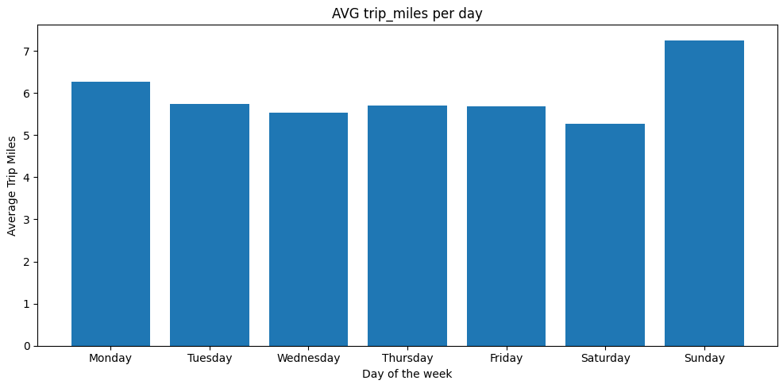
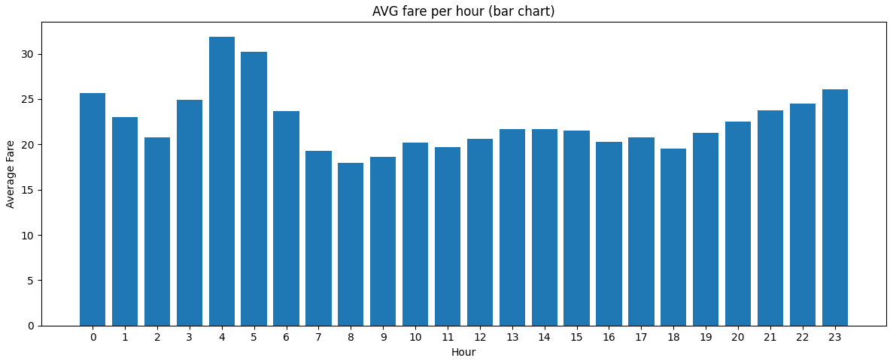
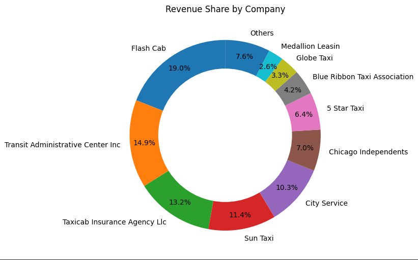
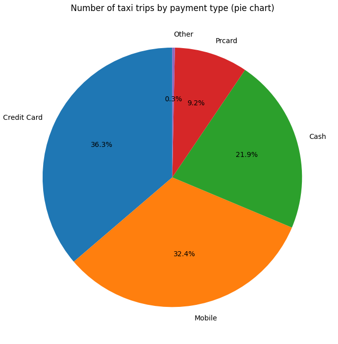
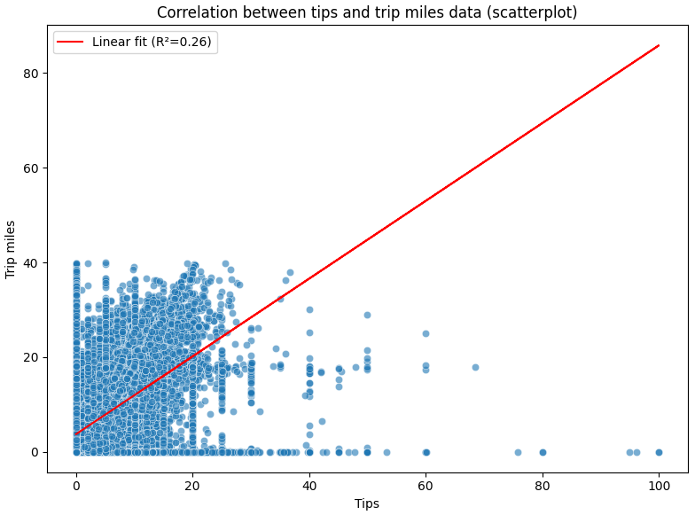

# Chicago Taxi Data – An Automated Process Flow

## Short Description
This project loads Chicago taxi trip data using an automated data processing and visualization pipeline.  
The goal is to get a cleaned large database in order to explore mobility patterns, revenue distribution, temporal trends, and external factors (such as weather) that may influence taxi usage.  
The workflow covers data ingestion, cleaning, transformation, analysis, and visualization in a reproducible manner.

---

## Used Datasources
- **Chicago Taxi Trips Dataset**  
  Public dataset containing detailed information about taxi trips in Chicago, including trip timestamps, distance, fare, payment type, and service provider.
- **Weather Data**  
  Historical temperature data joined to taxi trips to analyze potential correlations between weather conditions and travel behavior.
- **Chicago Community Areas**
  Scraped data to connect available IDs in taxi dataset with their names.

---

## Used Technologies
- **Python** – Core programming language for data processing and analysis  
- **Pandas** – Data cleaning, transformation, and aggregation  
- **NumPy** – Numerical operations and array-based computations  
- **Matplotlib & Seaborn** – Data visualization  
- **Scikit-learn** – Statistical analysis and linear regression modeling  
- **BeautifulSoup** – Web scraping and HTML parsing  
- **Requests** – HTTP requests for data retrieval from web APIs and sources  
- **Datetime** – Handling and manipulating date and time values  
- **Dateutil** – Advanced datetime parsing and timezone handling  
- **Typing** – Type hints for improved code readability and maintainability  
- **SQL** – Data extraction and preprocessing (if applicable)  
- **VS Code** – Development environment  
- **Git / GitHub** – Version control and documentation

---

## Process Flow

[Process flow](Pictures/processflow.png)

---

## Graphs

### 1. **AVG trip_miles per day**

**Analysis:**
- Longest usage on Sunday --> shopping, church, family visit, freetime activities
- Shorter trips on working days --> mostly work, school related travels

### 2. **AVG fare per hour**

**Analysis:**
- Higher average fares during evening - late night hours --> higher prices, but also longer travels (from downtown to suburbs)

### 3. **Share of company revenues in the examined period**

**Analysis:**
- More than 90% of all revenue goes to 10 companies.
- Flash Cab has the highest market share with around 20%- 

### 4. **Number of taxi trips by payment type**

**Analysis:**
- Paying with credit card is the most popular payment type with 36.3% share
- Cash is only 3rd on the list with 21.9% share

### 5. **Correlation between temperature and trip mile data**

**Analysis:**
- There's positive correlation between the two variable. However, since the value of R^2 is low, we cannot say that we can predict the value of the tip based on trip miles.

---